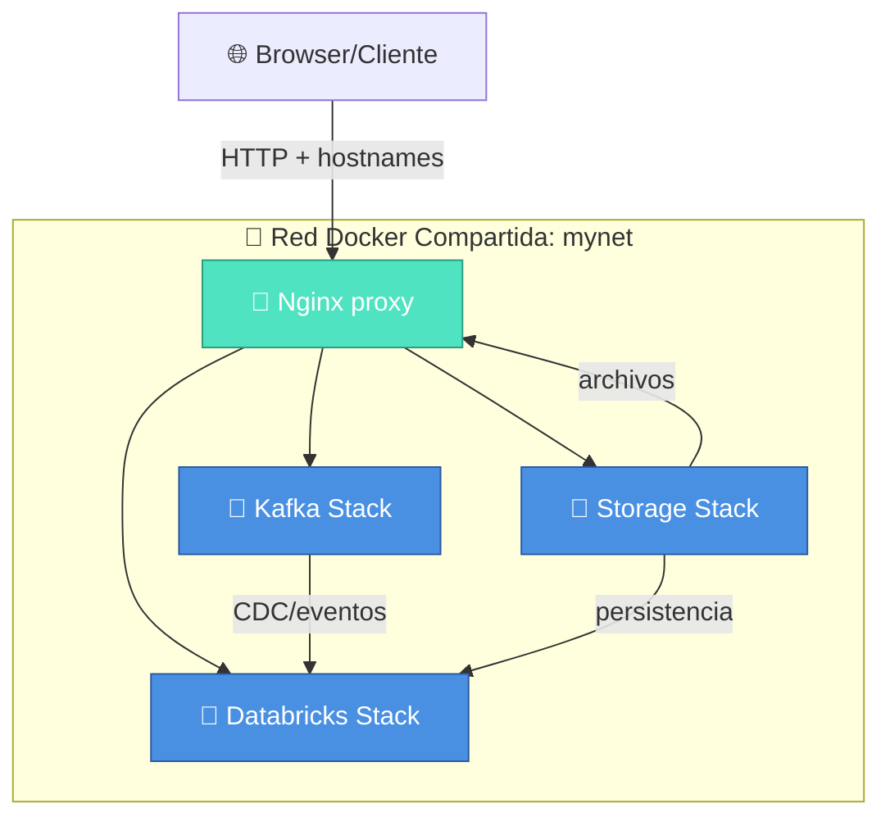

# 🐳 Docker Stacks

<div align="center">


**Laboratorio integrado de datos, mensajería e infraestructura con Docker Compose**

[Descripción](#descripción) • [Características](#características) • [Requisitos](#requisitos) • [Inicio Rápido](#inicio-rápido) • [Stacks](#stacks) • [Documentación](#documentación)

</div>

---

## Descripción

Laboratorio completo de Docker Compose para Windows con múltiples stacks independientes pero interconectados. Cada stack representa una arquitectura diferente (datos, mensajería, almacenamiento) que puedes usar de forma aislada o integrada mediante una red Docker compartida.

**Perfecto para:**
- 🎓 Aprendizaje de arquitecturas de datos
- 🧪 Validación de flujos de integración  
- 📊 Experimentación con streaming y CDC
- 🔬 Laboratorios controlados en tu máquina local
- 🏗️ Prototipos de infraestructura moderna

## Características

| Stack | Tecnologías | Caso de uso |
|-------|-------------|-----------|
| **databricks** | Spark • Jupyter • MLflow • Airflow • Vault • PostgreSQL | Análisis de datos y ML local |
| **kafka** | Kafka KRaft • Zookeeper • Debezium • PostgreSQL CDC | Mensajería, streaming y CDC |
| **storage** | SQL Server • DB2 • MinIO • SFTPGo • Apache | Almacenamiento polivalente |
| **web** | Nginx | Proxy inverso y orquestación |

---

## Arquitectura



---

## Requisitos

### Obligatorios
- ✅ **Docker Desktop** para Windows
- ✅ **WSL2** habilitado
- ✅ **PowerShell 5.0+** o PowerShell Core

### Red compartida
```powershell
docker network create mynet --driver bridge
```

### Configuración de hosts (opcional pero recomendado)
Edita `C:\Windows\System32\drivers\etc\hosts`:
```
127.0.0.1 sftp.dominio.com
127.0.0.1 minio.dominio.com
127.0.0.1 jupyter.dominio.com
127.0.0.1 mlflow.dominio.com
127.0.0.1 airflow.dominio.com
127.0.0.1 vault.dominio.com
127.0.0.1 kraft-ui.dominio.com
127.0.0.1 zoo-ui.dominio.com
```

---

## Inicio Rápido

### 1. Preparar el entorno
```powershell
# Crear la red compartida
docker network create mynet --driver bridge

# Navegar al repositorio
cd c:\Users\luisp\windows-code
```

### 2. Iniciar el proxy Nginx (recomendado)
```powershell
cd .\web
docker compose up -d
```

### 3. Iniciar los stacks según necesidad

**Para trabajar con datos y ML:**
```powershell
cd .\databricks
docker compose up -d
```

**Para mensajería y streaming:**
```powershell
cd .\kafka
docker compose up -d
```

**Para bases de datos y almacenamiento:**
```powershell
cd .\storage
docker compose up -d
```

### 4. Verificar servicios
```powershell
docker compose ps
docker network ls
```

---

## Stacks Disponibles

### 🔬 Databricks Stack
**Análisis de datos, ML y orquestación local**

- Apache Spark
- Jupyter Notebook
- MLflow (tracking de experimentos)
- Airflow (orquestación)
- HashiCorp Vault (gestión de secretos)
- PostgreSQL

📖 [Documentación completa](databricks/README.md)

### 📨 Kafka Stack
**Mensajería, streaming y Change Data Capture**

Incluye dos arquitecturas:
- **KRaft**: Cluster Kafka moderno sin Zookeeper (3 brokers)
- **Zookeeper**: Stack tradicional con Zookeeper + Kafka

Con Debezium Connect para CDC desde PostgreSQL.

📖 [Documentación completa](kafka/README.md)

### 💾 Storage Stack
**Bases de datos y almacenamiento**

- SQL Server (MSSQL) con bases de datos de muestra
- IBM DB2
- MinIO (S3 compatible)
- SFTPGo (servidor SFTP)
- Apache HTTP Server

📖 [Documentación completa](storage/README.md)

### 📡 Web Stack
**Proxy inverso y orquestación**

- Nginx como reverse proxy centralizado
- Enrutamiento por hostnames locales
- Orquestación de tráfico entre stacks

📖 [Documentación completa](web/README.md)

---

## Documentación

| Archivo | Descripción |
|---------|-----------|
| [`README.md`](README.md) | Este documento - guía principal |
| [`credenciales.md`](credenciales.md) | 🔐 Credenciales centralizadas de todos los stacks |
| [`config.md`](config.md) | ⚙️ Configuración global, hosts y variables de entorno |
| [`databricks/`](databricks/) | Stack de datos, ML y análisis |
| [`kafka/`](kafka/) | Stack de mensajería y streaming |
| [`storage/`](storage/) | Stack de almacenamiento y bases de datos |
| [`web/`](web/) | Proxy Nginx e integración |

---

## Uso Común

### Detener un stack
```powershell
cd .\<stack>
docker compose down
```

### Limpiar volúmenes (⚠️ borra datos)
```powershell
cd .\<stack>
docker compose down -v
```

### Ver logs en vivo
```powershell
cd .\<stack>
docker compose logs -f <servicio>
```

### Ejecutar comando en contenedor
```powershell
docker compose exec <servicio> <comando>
```

---

## Seguridad

⚠️ **Importante:** Este repositorio contiene credenciales de laboratorio. 

- Todas las credenciales están centralizadas en [`credenciales.md`](credenciales.md)
- **Antes de publicar**, reemplaza los valores por secrets seguros
- Usa gestión de secretos en producción
- No commits tokens o contraseñas reales

---

## Solución de Problemas

| Problema | Solución |
|----------|----------|
| ❌ Servicios no se comunican | Verifica que todos estén en `mynet`: `docker network inspect mynet` |
| ❌ Contenedor no inicia | Revisa logs: `docker compose logs -f <servicio>` |
| ❌ Hostnames no resuelven | Comprueba archivo `hosts` y que Nginx esté corriendo |
| ❌ Puerto en uso | Cambiar puerto en `docker-compose.yml` o parar contenedor conflictivo |
| ❌ Sin conexión a internet en contenedor | Verificar configuración DNS de Docker |

---

## Casos de Uso

### 📚 Aprendizaje
Perfecto para estudiar arquitecturas de datos sin cloud.

### 🧪 Pruebas de concepto
Valida flujos de integración antes de producción.

### 🔬 Experimentación
Laboratorio aislado para probar nuevas herramientas.

### 📊 Desarrollo local
Entorno reproducible para desarrollo en Windows.

---

## Tecnologías Incluidas

`Docker` `Docker Compose` `Spark` `Kafka` `Debezium` `PostgreSQL` `SQL Server` `MinIO` `Jupyter` `MLflow` `Airflow` `Vault` `Nginx` `Python` `DB2` `SFTPGo`

---

## Licencia

MIT License - Libre para uso educativo y de laboratorio.

---

<div align="center">

**Creado como laboratorio de ingeniería de datos en Windows**

[⬆ Volver arriba](#-docker-stacks)

</div>