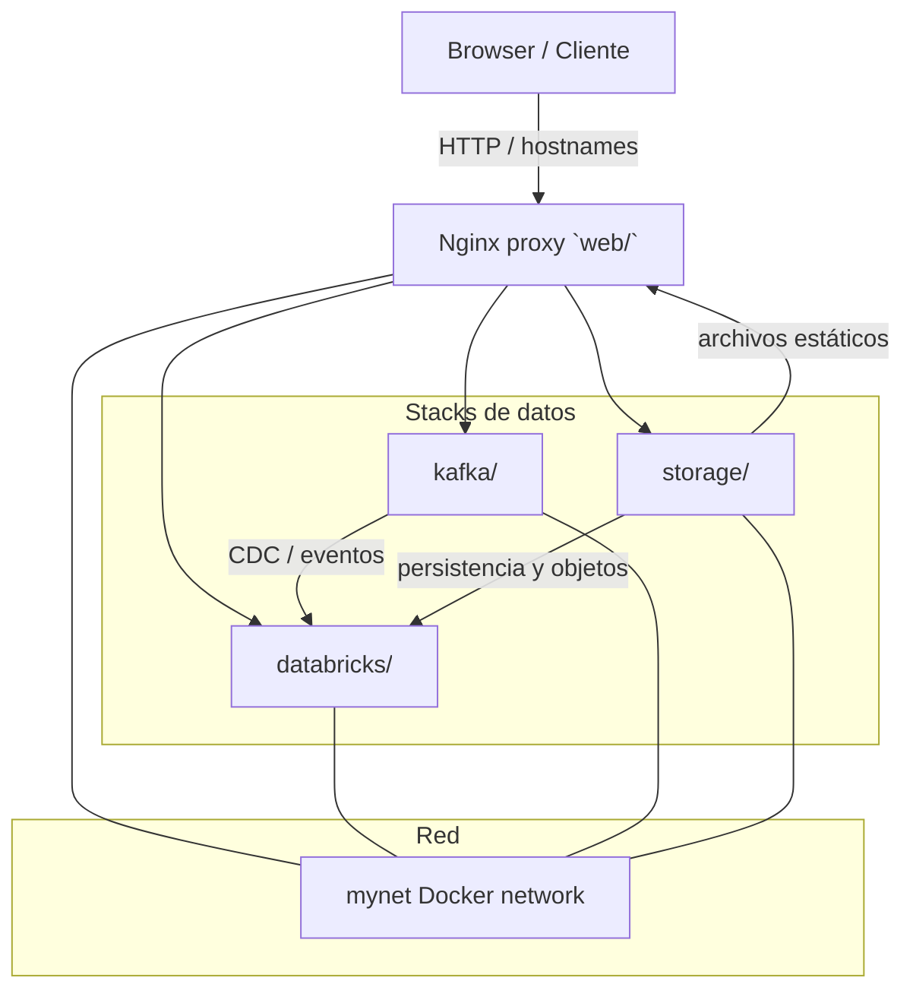

# Windows Code Docker Stacks

Docker stacks de prueba para un entorno controlado en Windows. Cada carpeta representa un stack independiente con su propio `docker-compose.yml` y servicios relacionados.

## Propósito del proyecto

Este repositorio agrupa varios laboratorios Docker para aprender, probar y validar arquitecturas de datos, mensajería y servicios de infraestructura.

- `databricks/`: Spark local, Jupyter, MLflow, Airflow, Vault, PostgreSQL y almacenamiento de metadatos.
- `kafka/`: Kafka KRaft, Kafka con Zookeeper, Debezium Connect, PostgreSQL CDC y consumidores Python.
- `storage/`: SQL Server, DB2, SFTPGo, MinIO y servidor de archivos Apache.
- `web/`: Nginx reverse proxy/gateway para exponer servicios internos de los demás stacks.

## Tags

`docker` `docker-compose` `windows` `spark` `mlflow` `airflow` `vault` `kafka` `debezium` `postgres` `sqlserver` `db2` `minio` `nginx` `sftp` `reverse-proxy`

## Introducción

Este README es el corazón del proyecto. Aquí encuentras la visión global, el flujo de arranque, los enlaces clave a cada stack y el contexto necesario para usar el repositorio con coherencia.

## Arquitectura global



## Índice de documentación

- [`README.md`](README.md) — este documento principal.
- [`credenciales.md`](credenciales.md) — credenciales centralizadas del repositorio.
- [`config.md`](config.md) — configuración global, hosts y recomendaciones de entorno.
- [`databricks/README.md`](databricks/README.md) — detalles del stack de datos y ML.
- [`databricks/config.md`](databricks/config.md) — configuraciones específicas del stack databricks.
- [`kafka/README.md`](kafka/README.md) — guía general del stack Kafka.
- [`kafka/config.md`](kafka/config.md) — parámetros y notas de configuración de Kafka.
- [`kafka/kafka-kraft/README.md`](kafka/kafka-kraft/README.md) — Kafka KRaft.
- [`kafka/kafka-zookeeper/README.md`](kafka/kafka-zookeeper/README.md) — Kafka tradicional con Zookeeper.
- [`storage/README.md`](storage/README.md) — detalles del stack de almacenamiento.
- [`storage/config.md`](storage/config.md) — configuración de volúmenes y rutas Windows.
- [`web/README.md`](web/README.md) — uso del proxy Nginx y hostnames locales.
- [`web/config.md`](web/config.md) — configuraciones adicionales de Nginx.

## Requisitos previos

- Docker Desktop instalado
- WSL2 habilitado en Windows
- Red Docker externa llamada `mynet`
- Carpetas locales existentes para los volúmenes de `storage/`
- Opcional: entradas en `C:\Windows\System32\drivers\etc\hosts` para nombres de host locales

## Inicio rápido

1. Crear la red Docker compartida:

```powershell
docker network create mynet --driver bridge
```

2. Iniciar el proxy `web` (recomendado para hostnames locales):

```powershell
cd .\web
docker compose up -d
```

3. Arrancar los stacks según tu objetivo:

- `databricks/` para análisis y ML local
- `storage/` para bases de datos y almacenamiento local
- `kafka/` para mensajería y CDC con Kafka

4. Verificar el estado de los contenedores:

```powershell
docker compose ps
```

## Acceso y hostnames

Para acceder a los servicios internos mediante nombres amigables, agrega estas líneas al archivo `hosts` de Windows:

```text
127.0.0.1 sftp.luispicado.com
127.0.0.1 minio.luispicado.com
127.0.0.1 minio-api.luispicado.com
127.0.0.1 data.luispicado.com
127.0.0.1 kraft-ui.luispicado.com
127.0.0.1 kraft-api.luispicado.com
127.0.0.1 zoo-ui.luispicado.com
127.0.0.1 zoo-api.luispicado.com
127.0.0.1 jupyter.luispicado.com
127.0.0.1 mlflow.luispicado.com
127.0.0.1 airflow.luispicado.com
127.0.0.1 vault.luispicado.com
127.0.0.1 spark.luispicado.com
```

## Stacks principales

| Stack | Contenido | Uso típico | Documentación |
|---|---|---|---|
| `databricks/` | Spark, Jupyter, MLflow, Airflow, Vault, PostgreSQL | Laboratorio de datos y ML | `databricks/README.md` |
| `kafka/` | Kafka KRaft y Zookeeper, Debezium, PostgreSQL CDC | Mensajería, streaming y CDC | `kafka/README.md` |
| `storage/` | SQL Server, DB2, MinIO, SFTPGo, Apache | Almacenamiento y bases de datos | `storage/README.md` |
| `web/` | Nginx reverse proxy para servicios locales | Exposición de servicios y hostnames | `web/README.md` |

## Enfoque del proyecto

Este repositorio está pensado como un laboratorio de ingeniería de datos e integración. No está diseñado para producción, pero sí para:

- probar flujos de datos desde bases de datos a Kafka,
- validar arquitecturas de datos locales en Windows,
- exponer entornos de prueba mediante un proxy central,
- practicar con stacks separados y conectados por red.

## Operación básica

```powershell
cd .\<stack>
docker compose up -d
```

Para detener y limpiar datos temporales:

```powershell
docker compose down
```

Para eliminar volúmenes persistentes:

```powershell
docker compose down -v
```

## Configuración centralizada

- `credenciales.md` contiene todas las credenciales definidas en los `docker-compose.yml`.
- `config.md` agrupa la configuración global de hosts y red.

## Buenas prácticas

- No copies contraseñas en los README individuales; usa `credenciales.md`.
- Cambia los secretos antes de compartir el repositorio.
- Conserva `mynet` como la red compartida de todos los stacks.
- Usa `web/` para exponer servicios de forma ordenada y con hostnames.

## Diagnóstico rápido

| Síntoma | Acción |
|---|---|
| No hay comunicación entre stacks | Verifica que la red `mynet` exista y que los servicios estén conectados a ella |
| Servicio no inicia | `docker compose logs -f` en la carpeta del stack correspondiente |
| Acceso a host local falla | Comprueba el archivo `hosts` y el proxy `web` |
| Contenedores no aparecen | Ejecuta `docker compose ps` desde la carpeta del stack |

## Nota de seguridad

Las contraseñas y tokens de `credenciales.md` se extraen directamente de los `docker-compose.yml`. Si publicas el repositorio, reemplaza estos valores por secrets seguros y usa mecanismos de gestión de secretos cuando sea posible.


