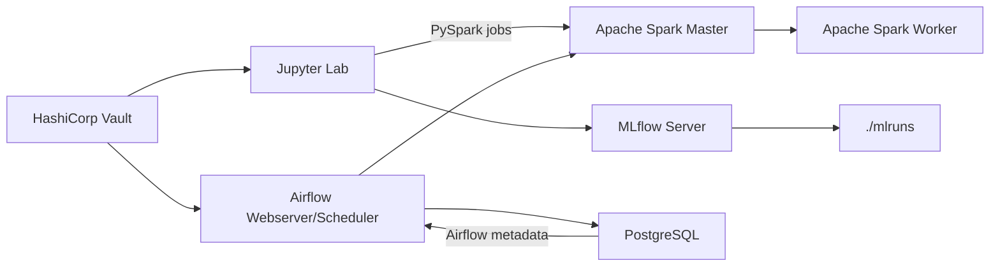

# Databricks-style Local Stack

Un laboratorio Docker para ingeniería de datos que combina Spark, Jupyter, MLflow, Airflow, Vault y PostgreSQL en un solo entorno local.

## Objetivo del stack

Este stack está diseñado para:
- Orquestar pipelines de datos y workflows con Airflow
- Ejecutar análisis y experimentos con Spark desde Jupyter
- Registrar modelos y métricas con MLflow
- Gestionar secretos con Vault
- Mantener datos persistentes en volúmenes y carpetas locales

## Arquitectura



## Servicios clave

| Servicio | Función | Persistencia |
|---|---|---|
| `spark` | Spark Master | `spark_data`, `spark_parquet` |
| `spark-worker` | Spark executor | `spark_parquet` |
| `jupyter` | Entorno interactivo | `./notebooks`, `./mlruns` |
| `mlflow` | Tracking de experimentos | `./mlruns` |
| `postgres` | Metadata de Airflow | `postgres_data` |
| `airflow-webserver` | UI de workflows | `./dags` |
| `airflow-scheduler` | Ejecución de DAGs | `./dags` |
| `vault` | Gestión de secretos | `./vault/data`, `./vault/config` |

## Quick Start

1. Asegura la red Docker externa `mynet`:

```powershell
docker network create mynet --driver bridge
```

2. Inicia el stack:

```powershell
cd .\databricks
docker compose up -d
```

3. Verifica el estado:

```powershell
docker compose ps
```

4. Accede a los servicios principales.

## Accesos principales

| Servicio | URL / Nota |
|---|---|
| Spark Master | `http://localhost:8080` |
| Jupyter Lab | `http://localhost:8888` (token: `mytoken`) |
| Airflow Webserver | `http://localhost:8081` |
| MLflow | No expuesto por defecto |
| Vault | No expuesto por defecto |

> Si necesitas acceso directo a MLflow o Vault, agrega `ports:` a los servicios correspondientes en `docker-compose.yml`.

## Casos de uso comunes

- **Exploración de datos**: carga datos en `notebooks/` y ejecuta jobs Spark.
- **ML experimentación**: usa MLflow para registrar runs y artefactos.
- **Orquestación**: define DAGs en `dags/` y valida con Airflow.
- **Secrets**: prueba conexiones seguras con Vault en modo dev.

## Comparativa de flujo

| Flujo | Beneficio |
|---|---|
| Spark + Jupyter | Desarrollo interactivo de análisis |
| Airflow + Postgres | Orquestación reproducible |
| MLflow + `mlruns` | Tracking de datos y modelos |
| Vault | Gestión de configuraciones sensibles |

## Recomendaciones

- Guarda tus notebooks en `notebooks/` para versionamiento.
- Mantén DAGs en `dags/` y no los edites dentro del contenedor.
- Si vas a reiniciar seguido, crea una imagen Docker con dependencias fijas.
- No uses este stack en producción sin refactorizar seguridad y escalabilidad.

## Detalles técnicos

- Jupyter instala `jupyter`, `jupyterlab`, `pyspark==3.5.0`, `delta-spark==3.0.0`, `hvac` al arrancar.
- Airflow usa `LocalExecutor`, apto para desarrollo.
- Vault está configurado en modo dev (`tls_disable = 1`).

## Operación y limpieza

```powershell
docker compose logs -f jupyter
docker compose logs -f airflow-webserver
docker compose down
docker compose down -v
```

## Documentación adicional

- `databricks/config.md` para detalles de red y volúmenes
- `..\credenciales.md` para credenciales globales si se agregan
