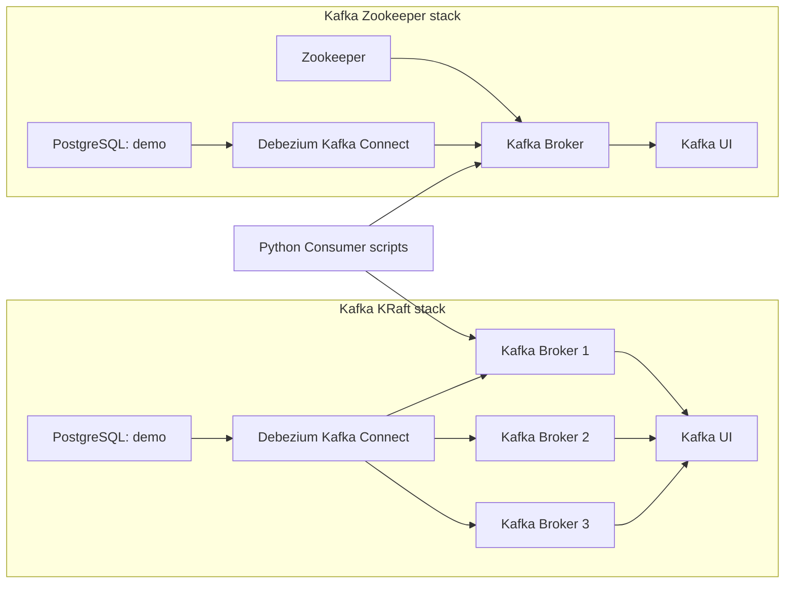

# Kafka Docker Stacks

Este directorio contiene dos topologías Kafka pensadas para experimentar con mensajería, CDC y arquitecturas legacy vs modernas.

## Qué incluye

- `kafka-kraft/`: Kafka KRaft con 3 brokers, Debezium Kafka Connect y Kafka UI.
- `kafka-zookeeper/`: Apache Kafka tradicional con Zookeeper, Debezium Kafka Connect y Kafka UI.
- `consumidor-kraft.py` y `consumidor-zookeeper.py` en cada subcarpeta para consumo directo.
- `consumer.py` como ejemplo genérico de consumidor Kafka.
- `config.md` con detalles de configuración.

## Arquitectura de Kafka



## Avance rápido

1. Crea la red Docker global si aún no existe:

```powershell
docker network create mynet --driver bridge
```

2. Inicia el stack de tu preferencia:

```powershell
cd .\kafka\kafka-kraft
docker compose up -d
```

o

```powershell
cd .\kafka\kafka-zookeeper
docker compose up -d
```

3. Revisa el estado de los contenedores:

```powershell
docker compose ps
```

4. Usa el consumidor apropiado según el stack:

- `kafka/kafka-kraft/consumidor-kraft.py`
- `kafka/kafka-zookeeper/consumidor-zookeeper.py`

## Comparativa KRaft vs Zookeeper

| Característica | KRaft | Zookeeper |
|---|---|---|
| Coordinador | Integrado en Kafka | Zookeeper externo |
| Complejidad | Menor | Mayor |
| Recomendado para | Nuevos laboratorios | Validación legacy |
| Brokers | 3 | 1 |
| Gestión de metadatos | Interna | Distribuida |

## Acceso de puertos

### Kafka KRaft

- Broker 1: `localhost:51437`
- Broker 2: `localhost:51438`
- Broker 3: `localhost:51439`
- PostgreSQL: `localhost:51440`

### Kafka Zookeeper

- Broker Kafka: `localhost:51435`
- PostgreSQL: `localhost:51436`

## Credenciales y configuración

- Consulta `..\credenciales.md` para ver todas las credenciales usadas en los `docker-compose.yml` del repositorio.
- Usa `kafka/config.md` para detalles de redes y parámetros adicionales.

## Recomendaciones

- Usa `kafka-kraft` para familiarizarte con Kafka moderno sin Zookeeper.
- Usa `kafka-zookeeper` para probar compatibilidad con arquitecturas clásicas.
- Si accedes desde el host, habilita los puertos de Kafka UI y Kafka Connect en el `docker-compose.yml` o usa el proxy `web`.

## Documentación adicional

- `kafka/kafka-kraft/README.md`
- `kafka/kafka-zookeeper/README.md`
- `kafka/config.md`

