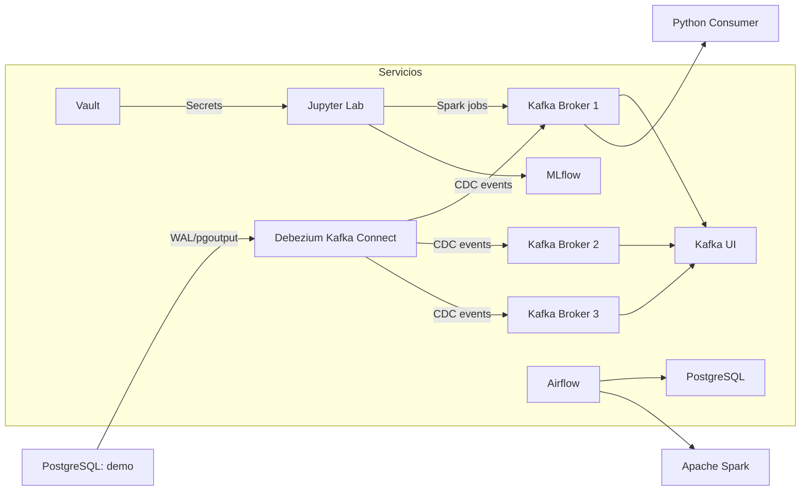

# Kafka KRaft Stack

Stack Docker independiente para Kafka en modo KRaft con 3 brokers, Kafka Connect y PostgreSQL. Ideal para pruebas de Change Data Capture (CDC) con un diseño moderno y sin Zookeeper.

## Propósito

Este stack está diseñado para:
- Estudiar Kafka KRaft en un entorno autónomo
- Ejecutar Debezium CDC sobre PostgreSQL
- Probar el ciclo completo de evento: BD → Kafka → consumidor Python
- Validar configuraciones de cluster y conectores en un laboratorio local

## Arquitectura



## Servicios y responsabilidades

| Servicio | Rol | Comentarios |
|---|---|---|
| `kafka1`, `kafka2`, `kafka3` | Brokers KRaft | Clúster Kafka moderno sin Zookeeper |
| `kafka-connect` | Debezium Connect | Captura CDC de PostgreSQL |
| `kafka-ui` | Monitor Kafka | Visualiza topics y mensajes |
| `postgres` | Fuente de datos | Base de datos `demo` para CDC |

## Quick Start

1. Asegúrate de tener la red Docker externa `mynet`:

```powershell
docker network create mynet --driver bridge
```

2. Levanta el stack:

```powershell
cd .\kafka\kafka-kraft
docker compose up -d
```

3. Verifica containers:

```powershell
docker compose ps
```

4. Crea la tabla de prueba y agrega datos en PostgreSQL.
5. Despliega el connector en Kafka Connect.
6. Verifica el topic `cdc.public.clientes` en Kafka UI.

## Puertos relevantes

| Servicio | Puerto host | Nota |
|---|---|---|
| Kafka Broker 1 | `51437` | Broker primario visible desde host |
| Kafka Broker 2 | `51438` | Broker secundario |
| Kafka Broker 3 | `51439` | Broker secundario |
| PostgreSQL | `51440` | BD `demo` |

> Nota: Los puertos de `kafka-ui` y `kafka-connect` están comentados en `docker-compose.yml`. Si no usas el proxy `web`, descoméntalos para acceso directo.

## Diferencias clave con Zookeeper

| Aspecto | KRaft | Zookeeper |
|---|---|---|
| Coordinación | Interna | Externa (Zookeeper) |
| Complejidad | Menor | Mayor |
| Escalabilidad | Mejor para nuevos clusters | Recomendado solo para legacy |
| Configuración | 3 brokers con roles de controlador incluidos | Broker único con Zookeeper separado |
| Recomendado para | Nuevos laboratorios y proyectos | Validación de compatibilidad legacy |

## Uso del consumidor

Utiliza el script localizado en esta carpeta:

```powershell
python .\consumidor-kraft.py
```

### Ejemplo de ejecución

```powershell
python .\consumidor-kraft.py --bootstrap-servers localhost:51437 --topic cdc.public.clientes --verbose
```

## Checklist esencial

- [ ] Red `mynet` creada
- [ ] Containers levantados con `docker compose up -d`
- [ ] Tabla `clientes` creada en PostgreSQL
- [ ] Connector Debezium desplegado
- [ ] Topic `cdc.public.clientes` presente
- [ ] Consumer Python recibiendo mensajes en tiempo real

## Configuración y credenciales

- Revisa `config.md` para los parámetros específicos del stack.
- Todas las credenciales están centralizadas en el root: `..\credenciales.md`.
