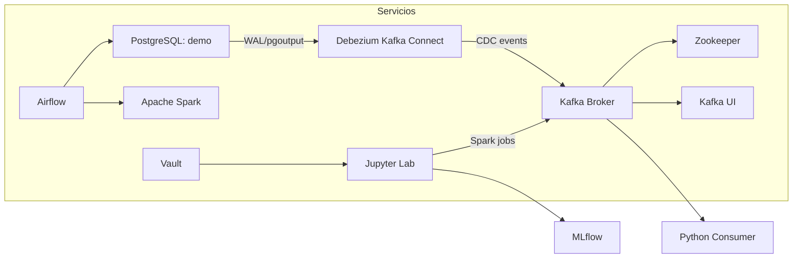

# Kafka Zookeeper Stack

Stack Docker independiente para Kafka en modo tradicional con Zookeeper, Kafka Connect y PostgreSQL. Diseñado para validar arquitecturas legacy y comparar con KRaft.

## Propósito

Este stack se utiliza para:
- Probar el flujo completo de CDC con Debezium y PostgreSQL
- Entender la arquitectura clásica de Kafka con Zookeeper
- Aprender los pasos de operación de clustering tradicional
- Comparar rendimiento y complejidad con Kafka KRaft

## Arquitectura



## Servicios y responsabilidades

| Servicio | Rol | Comentarios |
|---|---|---|
| `zookeeper` | Coordinador | Coordina el broker Kafka tradicional |
| `kafka` | Broker Kafka | Almacena eventos y topics |
| `kafka-connect` | Debezium Connect | Captura cambios de PostgreSQL |
| `kafka-ui` | Monitor Kafka | Visualiza topics y offsets |
| `postgres` | Fuente de datos | BD `demo` para CDC |

## Quick Start

1. Crea la red Docker `mynet`:

```powershell
docker network create mynet --driver bridge
```

2. Levanta el stack:

```powershell
cd .\kafka\kafka-zookeeper
docker compose up -d
```

3. Verifica que los servicios estén en `Up`:

```powershell
docker compose ps
```

4. Crea la tabla de prueba en PostgreSQL.
5. Despliega el connector en Kafka Connect.
6. Confirma el topic `cdc.public.clientes` en Kafka UI.

## Puertos relevantes

| Servicio | Puerto host | Nota |
|---|---|---|
| Kafka broker | `51435` | Broker principal |
| PostgreSQL | `51436` | Base `demo` |

> Si deseas acceso directo a Kafka UI o Kafka Connect, descomenta los puertos en `docker-compose.yml`.

## KRaft vs Zookeeper

| Pregunta | KRaft | Zookeeper |
|---|---|---|
| ¿Requiere Zookeeper? | No | Sí |
| ¿Ideal para nuevos proyectos? | Sí | No, solo compatibilidad legacy |
| ¿Número de brokers mínimo? | 3 | 1+ |
| ¿Complejidad de operación? | Menor | Mayor |
| ¿Uso en este repo? | `kafka-kraft` | `kafka-zookeeper` |

## Uso del consumidor

Ejecuta el script específico de este stack:

```powershell
python .\consumidor-zookeeper.py
```

### Ejemplo de ejecución

```powershell
python .\consumidor-zookeeper.py --bootstrap-servers localhost:51435 --topic cdc.public.clientes --verbose
```

## Checklist esencial

- [ ] `mynet` creada
- [ ] Containers levantados
- [ ] Tabla `clientes` creada en PostgreSQL
- [ ] Connector Debezium desplegado
- [ ] Topic `cdc.public.clientes` visible en Kafka UI
- [ ] Consumer recibiendo mensajes en tiempo real

## Configuración y credenciales

- Revisa `config.md` para detalles propios de este stack.
- Las credenciales del proyecto se almacenan en el root: `..\credenciales.md`.
