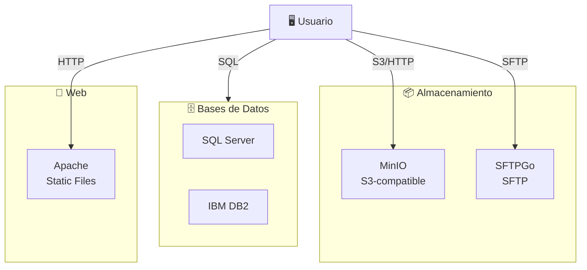

# 💾 Storage Stack

<div align="center">


**Almacenamiento multiformato: bases de datos, objetos y archivos**

[Descripción](#descripción) • [Servicios](#-servicios) • [Inicio Rápido](#-inicio-rápido) • [Configuración](#-configuración) • [Uso](#-uso)

</div>

---

## 📋 Descripción

Stack completo de almacenamiento con múltiples tecnologías:

- **SQL Server** - Base de datos relacional transaccional
- **IBM DB2** - Base de datos empresarial
- **MinIO** - Almacenamiento de objetos compatible con S3
- **SFTPGo** - Servidor SFTP con interfaz web
- **Apache HTTP Server** - Servidor de archivos estáticos

Perfecto para:
- 🗄️ Pruebas multi-BD
- 📦 Almacenamiento de objetos local
- 📤 Transferencias SFTP
- 📊 Pipelines de ingesta de datos
- 🧪 Laboratorios de integración

---

## 🛠️ Servicios

| Servicio | Puerto | Tipo | Descripción |
|----------|--------|------|------------|
| **SQL Server** | 1433 | Base de datos | Relacional transaccional |
| **DB2** | 50000 | Base de datos | Empresarial IBM |
| **MinIO** | 9000 | Objetos | S3-compatible |
| **SFTPGo** | 2022 | Transferencia | Servidor SFTP |
| **Apache** | 80 | Web | Servidor de archivos |

---

## 🚀 Inicio Rápido

### 1. Preparar directorios locales
```powershell
# Windows - crear carpetas
New-Item -Path "F:\\sftp" -ItemType Directory -Force
New-Item -Path "F:\\sftpgo-data" -ItemType Directory -Force
New-Item -Path "F:\\minio-data" -ItemType Directory -Force
New-Item -Path "F:\\apache-fileserver" -ItemType Directory -Force
```

### 2. Iniciar stack
```powershell
cd .\\storage
docker compose up -d
docker compose ps
```

---

## ⚙️ Configuración

### Volúmenes locales
```yaml
# SQL Server
volumes:
  - sqlserver_data:/var/opt/mssql

# DB2
volumes:
  - db2_data:/home/db2inst1/db2inst1

# SFTPGo
volumes:
  - F:\\sftp:/data/sftp

# MinIO
volumes:
  - F:\\minio-data:/data

# Apache
volumes:
  - F:\\apache-fileserver:/var/www/html
```

### Credenciales

Ver [`credenciales.md`](../credenciales.md):
- 🔐 SQL Server user/password
- 🔑 DB2 user/password
- 🗝️ MinIO access/secret keys
- 👤 SFTPGo users

---

## 💼 Uso Común

### SQL Server

#### Conectar
```powershell
docker compose exec sqlserver sqlcmd -S localhost -U sa
```

#### Crear DB
```sql
CREATE DATABASE MyDatabase;
```

#### Restaurar backup
```powershell
# Copiar .bak a volumen
docker compose cp "AdventureWorks2022.bak" sqlserver:/var/opt/mssql/backup/

# En SQL
RESTORE DATABASE MyDatabase FROM DISK = '/var/opt/mssql/backup/MyDB.bak'
```

### DB2

#### Conectar
```powershell
docker compose exec db2 bash
db2 connect to sample
```

#### Listar bases de datos
```bash
db2 list db directory
```

### MinIO

#### Ver consola
```powershell
# MinIO Console en puerto 9000
# Acceso web automático si está expuesto
```

#### Cliente Python
```python
from minio import Minio
client = Minio(
    "localhost:9000",
    access_key="minioadmin",
    secret_key="minioadmin",
    secure=False
)
```

### SFTPGo

#### Acceder a UI
```
http://localhost:8080/web/
```

#### Conectar por SFTP
```bash
sftp -P 2022 user@localhost
```

### Apache

#### Agregar archivos
```powershell
# Copiar a F:\\apache-fileserver
# Accesible en http://localhost/
```

---

## 🏗️ Arquitectura



---

## 🔌 Integración

### Con Kafka (CDC)
- PostgreSQL (en Kafka stack) se replica a SQL Server
- MinIO recibe backups de topics

### Con Databricks
- Spark lee desde SQL Server via JDBC
- Escribe resultados a MinIO

---

## 🛑 Operaciones

### Detener
```powershell
docker compose down
```

### Limpiar (⚠️ borra datos)
```powershell
docker compose down -v
```

### Ver logs
```powershell
docker compose logs -f sqlserver
docker compose logs -f db2
docker compose logs -f minio
```

### Backup SQL Server
```powershell
docker compose exec sqlserver sqlcmd -S localhost -U sa -Q "BACKUP DATABASE [dbname] TO DISK='/var/opt/mssql/backup/dbname.bak'"
```

---

## ✋ Problemas

| Problema | Solución |
|----------|----------|
| ❌ SQL Server no inicia | Aumentar memoria Docker (mínimo 2GB) |
| ❌ DB2 timeout | Esperar 60+ seg en primer inicio |
| ❌ MinIO volumen vacío | Verificar permisos en F:\\minio-data |
| ❌ SFTPGo sin conectar | Revisar puerto 2022 disponible |
| ❌ Apache 403 Forbidden | Revisar permisos en F:\\apache-fileserver |

---

## 📚 Recursos

- [SQL Server Docker](https://hub.docker.com/_/microsoft-mssql-server)
- [IBM DB2 Docker](https://hub.docker.com/r/ibmcom/db2)
- [MinIO](https://min.io/) - S3-compatible storage
- [SFTPGo](https://sftpgo.github.io/) - SFTP server

---

<div align="center">

[⬆ Arriba](#-storage-stack) • [← Proyecto Principal](../README.md)

</div>
