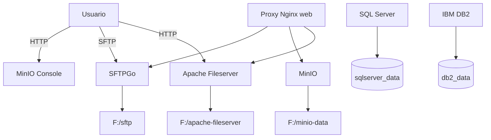

# Storage Stack

Stack Docker para servicios de almacenamiento y datos: SQL Server, IBM DB2, SFTPGo, MinIO y Apache HTTP File Server.

## Objetivo

Crear un entorno de prueba local para:
- Bases de datos transaccionales (SQL Server, DB2)
- Almacenamiento de objetos (MinIO)
- Transferencias de archivos SFTP (SFTPGo)
- Servir contenido estático (Apache)

## Arquitectura



## Servicios principales

| Servicio | Función | Almacenamiento |
|---|---|---|
| `sqlserver` | SQL Server local | `sqlserver_data` |
| `db2` | IBM DB2 local | `db2_data` |
| `sftpgo` | SFTP + administración | `F:/sftp`, `F:/sftpgo-data` |
| `minio` | Almacenamiento de objetos | `F:/minio-data` |
| `apache-fileserver` | Servir archivos estáticos | `F:/apache-fileserver` |

## Quick Start

1. Asegura que las rutas locales existen:
   - `F:/sftp`
   - `F:/sftpgo-data`
   - `F:/minio-data`
   - `F:/apache-fileserver`

2. Levanta el stack:

```powershell
cd .\storage
docker compose up -d
```

3. Verifica el estado:

```powershell
docker compose ps
```

## Accesos y puertos

| Servicio | Puerto host | Nota |
|---|---|---|
| SQL Server | `51430` | `1433` interno |
| DB2 | `51431` | `50000` interno |
| SFTPGo | `51432` | `2022` SFTP |
| MinIO | No expuesto | Activar `ports:` para host |
| Apache | No expuesto | Activar `ports:` para host |

> MinIO y Apache no exponen puertos por defecto. Si usas el proxy `web`, accede mediante hostnames en lugar de conexiones directas.

## Casos de uso

- **Data vaulting**: files SFTP y objetos MinIO para ingestion pipelines
- **Datos transaccionales**: SQL Server y DB2 para pruebas de ETL
- **Entrega de contenido**: Apache sirve frontends o artefactos estáticos
- **Integración local**: proxy `web` permite un punto de acceso central

## Mejores prácticas

- Evita editar datos directamente dentro del contenedor.
- Usa rutas locales persistentes para datos montados.
- Para reproducibilidad, define volumes claros en `docker-compose.yml`.
- Si trabajas en Windows, verifica permisos de carpeta y compatibilidad con Docker Desktop.

## Configuración

- `docker-compose.yml` monta rutas de Windows en los servicios.
- Si no deseas usar `F:/`, reemplaza las rutas por directorios locales adecuados.
- `SFTPGo` usa SQLite internamente para su metadata.
- `MinIO` se inicia con credenciales definidas en el compose.

## Matriz de decisiones

| Necesidad | Servicio recomendado |
|---|---|
| Base de datos relacional local | SQL Server o DB2 |
| Almacenamiento de objetos local | MinIO |
| Acceso de archivos mediante cliente | SFTPGo |
| Servir archivos estáticos | Apache |

## Documentación adicional

- `storage/config.md` para detalles de volúmenes y rutas
- `..\credenciales.md` para credenciales globales

**Importante:** no copies credenciales en este README; usa `credenciales.md` para centralizarlas.
