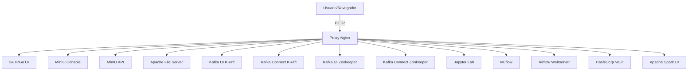

# Web Proxy Stack

Proxy Docker basado en Nginx para exponer los servicios internos del repositorio mediante nombres de dominio locales.

## Objetivo

Este stack centraliza el acceso HTTP de los stacks de infraestructura y datos sin exponer los puertos de cada servicio directamente al host.

- Maneja rutas de proxy para `storage`, `kafka` y `databricks`
- Permite usar hostnames amigables como `minio.luispicado.com`
- Simplifica pruebas de integración local

## Arquitectura de enrutamiento



## Servicios

| Host local | Servicio interno | Comentario |
|---|---|---|
| `sftp.luispicado.com` | `sftpgo:51500` | UI de SFTPGo |
| `minio.luispicado.com` | `minio:9001` | Consola MinIO |
| `minio-api.luispicado.com` | `minio:9000` | API MinIO |
| `data.luispicado.com` | `apache-fileserver:80` | Servidor de archivos estático |
| `kraft-ui.luispicado.com` | `kafka-ui-kraft:8080` | UI Kafka KRaft |
| `kraft-api.luispicado.com` | `kafka-connect-kraft:8083` | API Kafka Connect KRaft |
| `zoo-ui.luispicado.com` | `kafka-ui-zoo:8080` | UI Kafka Zookeeper |
| `zoo-api.luispicado.com` | `kafka-connect-zoo:8083` | API Kafka Connect Zookeeper |
| `jupyter.luispicado.com` | `jupyter:8888` | Jupyter Lab |
| `mlflow.luispicado.com` | `mlflow:5000` | MLflow Tracking |
| `airflow.luispicado.com` | `airflow-webserver:8080` | Airflow UI |
| `vault.luispicado.com` | `vault:8200` | Vault UI |
| `spark.luispicado.com` | `spark:8080` | Spark Master UI |

## Uso recomendado

1. Levanta el stack `web`:

```powershell
cd .\web
docker compose up -d
```

2. Asegúrate de que los demás stacks estén en la red `mynet`.
3. Agrega las entradas de hosts locales para los dominios proxy.
4. Accede desde el navegador usando los hostnames definidos.

## Configuración de hosts

Agrega estas líneas a tu `C:\Windows\System32\drivers\etc\hosts`:

```text
127.0.0.1 sftp.luispicado.com
127.0.0.1 minio.luispicado.com
127.0.0.1 minio-api.luispicado.com
127.0.0.1 data.luispicado.com
127.0.0.1 kraft-ui.luispicado.com
127.0.0.1 kraft-api.luispicado.com
127.0.0.1 zoo-ui.luispicado.com
127.0.0.1 zoo-api.luispicado.com
127.0.0.1 jupyter.luispicado.com
127.0.0.1 mlflow.luispicado.com
127.0.0.1 airflow.luispicado.com
127.0.0.1 vault.luispicado.com
127.0.0.1 spark.luispicado.com
```

## Consideraciones de seguridad

- `nginx.conf` actualmente no tiene certificados TLS configurados.
- No expongas este proxy en entornos no controlados sin habilitar HTTPS.
- Usa el proxy solo para desarrollo y pruebas locales.

## Diagnóstico rápido

| Síntoma | Verificar |
|---|---|
| No responde `jupyter.luispicado.com` | `docker compose ps`, servicio `jupyter` activo |
| No responde `minio.luispicado.com` | `minio` en la red `mynet` |
| Hostname no resuelve | `/etc/hosts` o `C:\Windows\System32\drivers\etc\hosts` |
| Proxy se cae | `docker compose logs -f nginx` |

## Documentación adicional

- `web/config.md`: detalles de configuración de Nginx y requisitos de red
- `..\credenciales.md`: credenciales globales si aplican a servicios proxy
