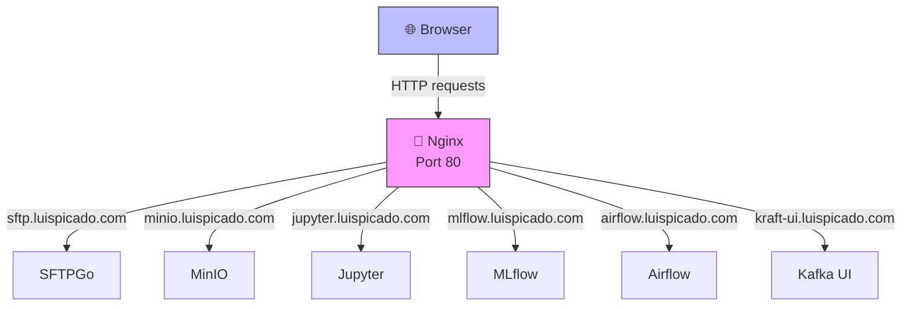

# 📡 Web Stack

<div align="center">


**Proxy centralizado para orquestación de stacks**

[Descripción](#descripción) • [Servicios](#-servicios) • [Inicio Rápido](#-inicio-rápido) • [Configuración](#-configuración) • [Rutas](#-rutas)

</div>

---

## 📋 Descripción

Stack de **Nginx** como proxy inverso centralizado para todos los servicios.

**Beneficios:**
- ✅ Acceso unificado por hostnames locales
- ✅ Enrutamiento automático a servicios internos
- ✅ Simplifica integración entre stacks
- ✅ Gestión centralizada de puertos
- ✅ Sin necesidad de exponer puertos individuales

---

## 🚀 Inicio Rápido

```powershell
cd .\\web
docker compose up -d
docker compose ps
```

---

## 📍 Servicios y rutas

| Hostname | Servicio | Descripción |
|----------|----------|------------|
| **sftp.luispicado.com** | SFTPGo:8080 | UI SFTP |
| **minio.luispicado.com** | MinIO:9001 | Consola MinIO |
| **minio-api.luispicado.com** | MinIO:9000 | API S3 |
| **data.luispicado.com** | Apache:80 | Archivos estáticos |
| **kraft-ui.luispicado.com** | Kafka UI KRaft:8080 | Monitor Kafka |
| **kraft-api.luispicado.com** | Debezium KRaft:8083 | Connect |
| **zoo-ui.luispicado.com** | Kafka UI Zoo:8080 | Monitor Zoo |
| **zoo-api.luispicado.com** | Debezium Zoo:8083 | Connect Zoo |
| **jupyter.luispicado.com** | Jupyter:8888 | Notebooks |
| **mlflow.luispicado.com** | MLflow:5000 | ML Tracking |
| **airflow.luispicado.com** | Airflow:8080 | Orquestación |
| **vault.luispicado.com** | Vault:8200 | Gestión secretos |
| **spark.luispicado.com** | Spark:8080 | Cluster Spark |

---

## ⚙️ Configuración

### Archivo hosts Windows

Editar: `C:\Windows\System32\drivers\etc\hosts`

```text
127.0.0.1 sftp.luispicado.com
127.0.0.1 minio.luispicado.com
127.0.0.1 minio-api.luispicado.com
127.0.0.1 data.luispicado.com
127.0.0.1 kraft-ui.luispicado.com
127.0.0.1 kraft-api.luispicado.com
127.0.0.1 zoo-ui.luispicado.com
127.0.0.1 zoo-api.luispicado.com
127.0.0.1 jupyter.luispicado.com
127.0.0.1 mlflow.luispicado.com
127.0.0.1 airflow.luispicado.com
127.0.0.1 vault.luispicado.com
127.0.0.1 spark.luispicado.com
```

### Network Docker

Todos los servicios en red `mynet`:
```bash
docker network create mynet --driver bridge
```

---

## 💼 Uso

### Acceder a servicios

```powershell
# Jupyter Lab
http://jupyter.luispicado.com

# MinIO Console
http://minio.luispicado.com

# MLflow
http://mlflow.luispicado.com

# Airflow
http://airflow.luispicado.com

# Kafka Monitor
http://kraft-ui.luispicado.com
```

### Configurar nuevas rutas

Editar `nginx.conf`:
```nginx
upstream mi_servicio {
    server mi-contenedor:puerto;
}

server {
    listen 80;
    server_name mi-servicio.luispicado.com;
    
    location / {
        proxy_pass http://mi_servicio;
    }
}
```

Recargar:
```powershell
docker compose exec nginx nginx -s reload
```

---

## 🏗️ Arquitectura



---

## 🔌 Integración con stacks

### Storage
- MinIO disponible en `minio.luispicado.com`
- SFTPGo en `sftp.luispicado.com`
- Apache en `data.luispicado.com`

### Kafka
- KRaft UI en `kraft-ui.luispicado.com`
- Zookeeper UI en `zoo-ui.luispicado.com`
- Debezium API en `kraft-api.luispicado.com`

### Databricks
- Jupyter en `jupyter.luispicado.com`
- MLflow en `mlflow.luispicado.com`
- Airflow en `airflow.luispicado.com`
- Spark en `spark.luispicado.com`

---

## 🛑 Operaciones

### Detener
```powershell
docker compose down
```

### Ver logs
```powershell
docker compose logs -f nginx
```

### Recargar configuración
```powershell
docker compose exec nginx nginx -s reload
```

### Verificar servicios
```powershell
docker network inspect mynet
```

---

## ✋ Problemas

| Problema | Solución |
|----------|----------|
| ❌ Hostname no resuelve | Verificar `/etc/hosts` |
| ❌ 502 Bad Gateway | Servicio no activo o no en `mynet` |
| ❌ Nginx no inicia | `docker compose logs nginx` |
| ❌ Puerto 80 en uso | Cambiar puerto en `docker-compose.yml` |

---

## ⚠️ Seguridad

- Solo para **desarrollo local**
- Sin TLS/HTTPS configurado
- No expongas en redes no controladas
- Para producción: agregar certificados SSL

---

## 📚 Recursos

- [Nginx Documentation](https://nginx.org/en/docs/)
- [Nginx Proxy Config](https://nginx.org/en/docs/http/ngx_http_proxy_module.html)

---

<div align="center">

[⬆ Arriba](#-web-stack) • [← Proyecto Principal](../README.md)

</div>
